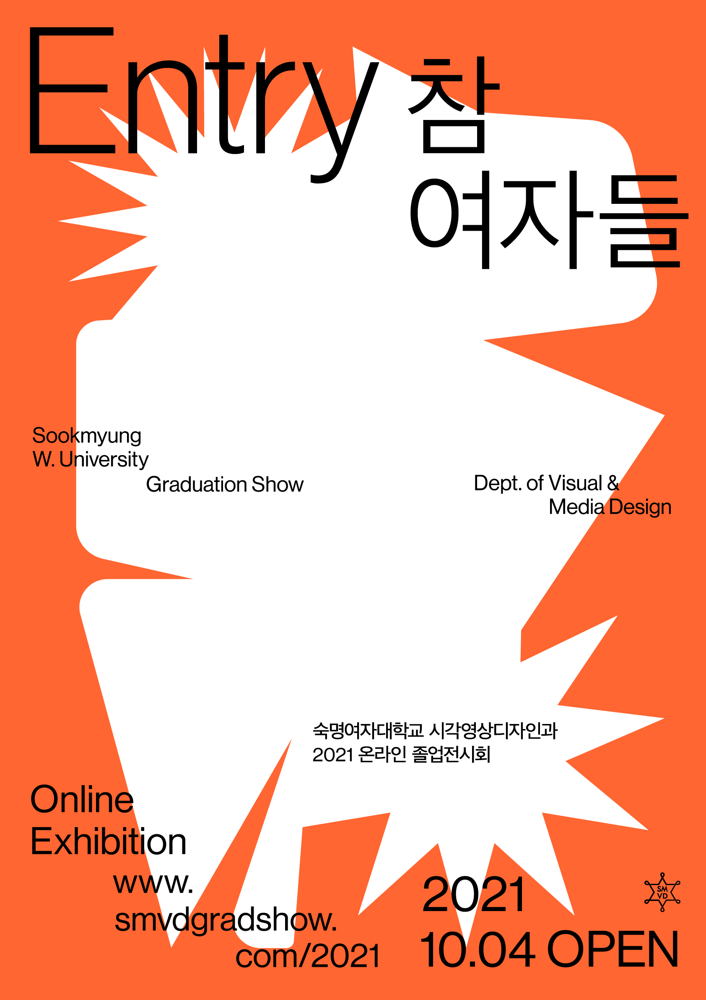

# 2021 SMVD GRADUATION EXHIBITION WEBSITE

2021 숙명여자대학교 시각영상디자인과 졸업전시회 웹사이트 전체 퍼블리싱 작업 및 기획,디자인 진행

## key function
### 1.open intro interaction
- 메인 페이지에서 버튼 클릭 시 박스가 열리며 전시 개요의 내용을 보여주는 인터랙션 구현
- 박스가 열린 후 브라우저 resizing 이벤트 발생 시 브라우저 크기에 맞춰 박스의 크기를 조절하는 기능 구현
- 열림/닫힘에 따라 화살표의 방향을 변경하는 인터랙션 구현
- 모바일 페이지에서는 세로로 열리는 모션

### 2.scroll event
- 전시 작품 리스트 페이지에서 스크롤이 어느 섹션에 있는지에 따라 좌측 카테고리에 밑줄이 생기는 이벤트, 카테고리 클릭 시 해당 섹션으로 이동과 함께 밑줄이 생기는 이벤트 구현.

### 3.responsive web
- 전시 작품 리스트 페이지에서 다양한 접속 환경을 고려하여 웹 브라우저 크기에서는 hover를 통해 작품 정보를 볼 수 있도록 디자인 및 구현, 패드 크기에서는 hover가 불가능한 점을 고려하여 작품 정보를 썸네일 아래에 보여주는 형식으로 나타나도록 구현.
- 이 외에도 모바일 크기를 고려하여 메인 페이지의 디자인 수정사항 반영, 레이아웃 변경 등의 작업 진행.

### 4.countdown
- 오픈 전 접속자들의 전시 접근을 막기 위한 카운트다운 페이지 설정. 날짜 객체를 받아와 이를 각각 d-day, 남은 시간으로 계산해 화면에 출력하는 기능 구현.

